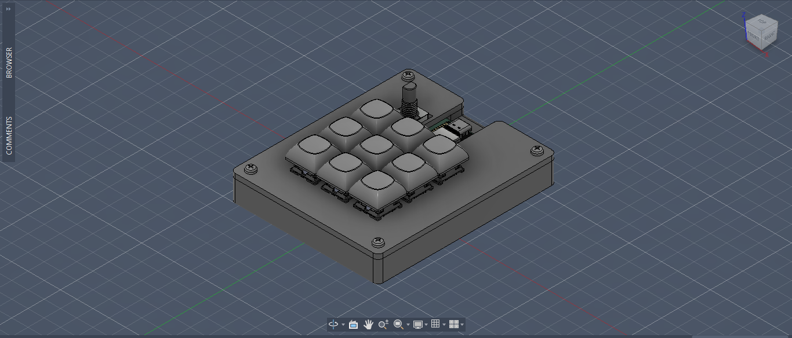
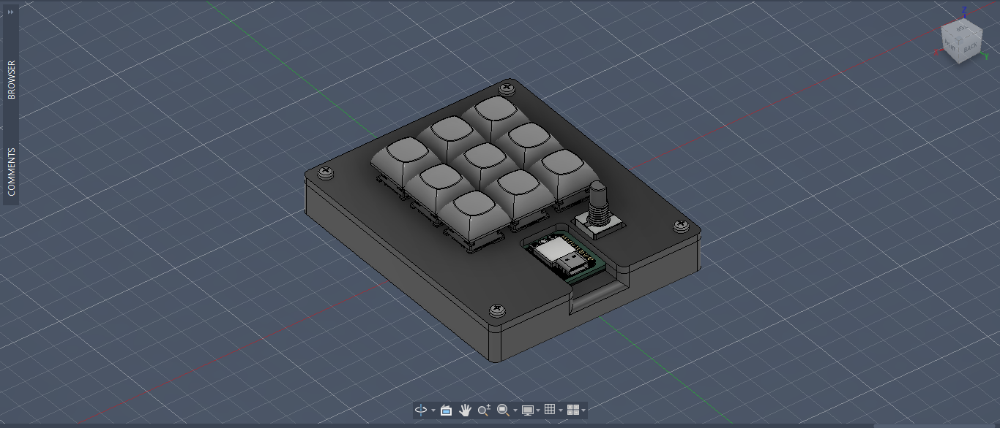
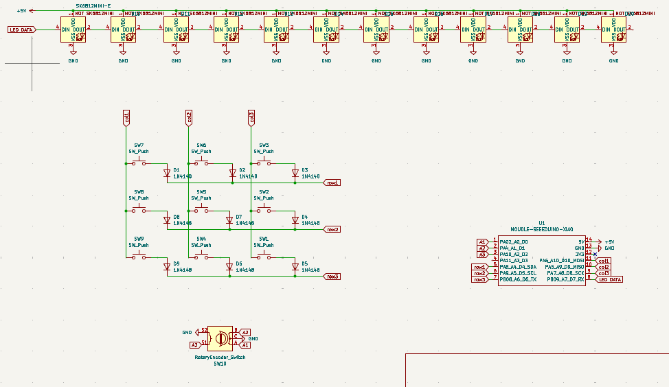
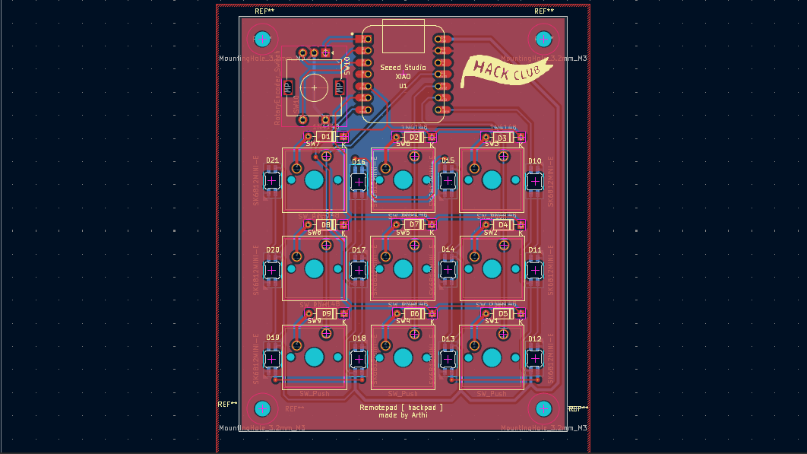
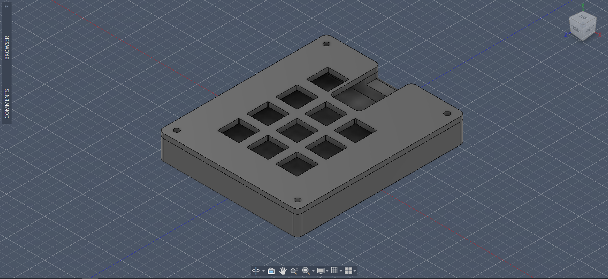

## Remotepad 
A macropad with 9 keys with a rotary encoder for voulume up and down. It was 12 SK6812 MINI-E LEDs around the keys for RGB lightning. The keys are wired in a matix configuration. It uses QMK firmware and VIA.

## CAD
The Remotepad!.

## Schematic
It uses a XIAO RP2040, 9 diodes, 9 mx cherry switches, 1 rotary encoder and 12 SK6812 MINI-E LEDs.

## PCB
I used 0.4mm traces is most parts and 0.6mm for the power connections.

## Case
The case is connected by four M3x16mm screws and four M3x5mx4mm heatset inserts. The case is printed in two parts, top and bottom

## Firmware
It uses QMK FIremwire I have plans to cutomize the layer to use them with my other projects like rover. for now it should have one singe layer.

## BOM

| Component | Quantity |
|-----------|----------|
| XIAO RP2040 | 1x |
| MX-Style Switch | 9x |
| 1N4148 Diode | 9x |
| Blank DSA keycaps | 9x | 
| SK6812 MINI-E LEDs | 12x | 
| EC11 rotary encoder | 1x 
| M3 x 6mm Screws | 4x | 
| M3x5mx4mm heatset inserts  |4x | 
| Custom PCB | 1x |
| 3D printed case | 1x |

